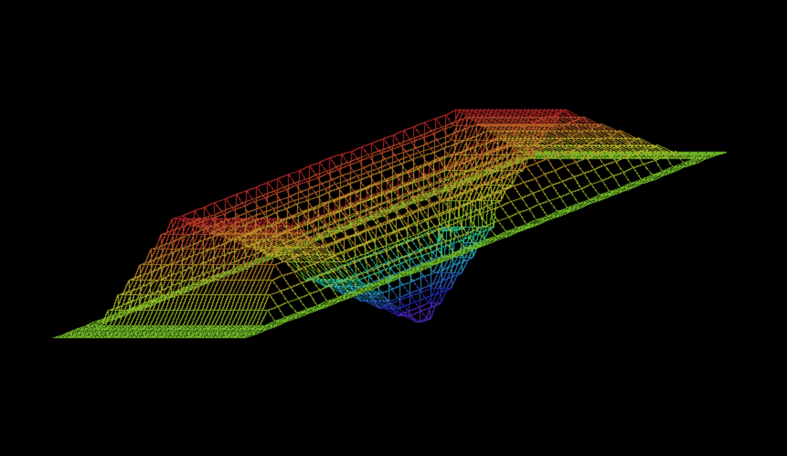
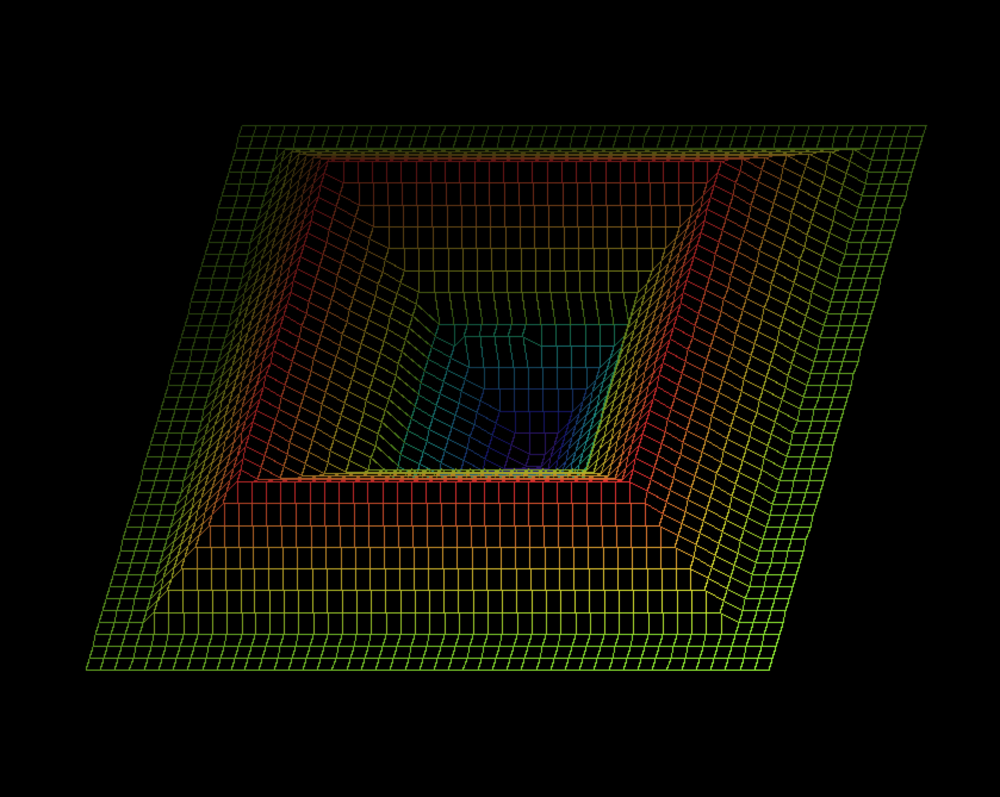

# FDF

## Make

To generate the binary please compile using the following command: 

```
make
```

## Usage

```bash
./fdf <maps_path> [flags]

```
## maps_path

Relative path to a well formatted map. 

Example: 

```bash
./fdf ./fdf maps/42.fdf
```

## Flags

`-b`: brightness based on depth
`-c`: color based on height

## Actions

### Rotation: 

Numpad only: 

- `4` and `6`: `x` axis rotation
- `8` and `3`: `y` axis rotation
- `1` and `9`: `z` axis rotation

### Zoom 

- `+`: zoom in
- `-`: zoom out


## Examples




